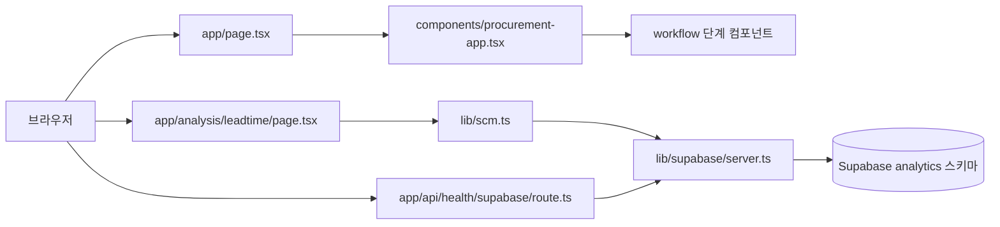

# superSCM 프로젝트 아키텍처

> 기기·옵션 월간 발주계획 시스템의 현재 코드 구조를 기준으로 작성한 문서입니다.
> 작성 기준일: 2026-08-27

## 1. 한눈에 보는 요약

### 프로젝트 목적

한국후지필름BI의 월간 발주계획을 준비하는 Next.js MVP입니다. 사용자는 전체 현황에서 시작해 수요 확정, 재고·공급 확인, 마스터 검증, 발주량 계산, 보고자료 확인의 순서로 업무 흐름을 살펴봅니다.

현재 애플리케이션은 두 가지 성격이 함께 있습니다.

- `/`: 업무 흐름을 보여주는 Phase 1 로컬 프로토타입입니다. 대부분의 값은 컴포넌트 안의 샘플 데이터이며, 브라우저 상태로만 동작합니다.
- `/analysis/leadtime`: Supabase의 `analytics.v_leadtime_gap`를 서버에서 조회해 실제 분석 표를 보여주는 데이터 연결 화면입니다.

### 기술 구조 요약

| 영역 | 구현 | 주요 위치 | 역할 |
|---|---|---|---|
| 웹 프레임워크 | Next.js 15 App Router | `app/` | 라우팅, 레이아웃, 서버 페이지, Route Handler |
| UI | React 19 + TypeScript | `components/`, `app/` | 업무 단계 화면과 분석 화면 렌더링 |
| 스타일 | 전역 순수 CSS | `app/globals.css` | 모든 화면의 레이아웃·컴포넌트 스타일 |
| 아이콘 | `lucide-react` | 각 UI 컴포넌트 | 상태·업무 아이콘 표시 |
| 도메인 모델 | 순수 TypeScript | `lib/scm-model.ts` | DB 행을 화면 모델로 정규화 |
| 데이터 조회 | Supabase JS | `lib/scm.ts` | `analytics` 스키마 조회를 한 곳에서 담당 |
| DB 연결 | `@supabase/ssr`, `@supabase/supabase-js` | `lib/supabase/` | 브라우저·서버 클라이언트와 환경변수 관리 |
| DB 구조 | PostgreSQL/Supabase | `SCHEMA.md`, `sql/`, `supabase/` | `raw`, `core`, `analytics` 계층과 수요확정 테이블 정의 |
| 테스트 | Node test runner | `lib/scm-model.test.ts` | 정규화 함수의 컬럼 별칭·기본값 검증 |
| 배포 | Vercel Next.js preset | `vercel.json` | Next.js 애플리케이션 배포 설정 |

### 전체 흐름



### 의존 방향

```text
app 라우트
  ├─ components UI
  └─ lib 조회·모델
       └─ lib/supabase 연결
            └─ Supabase

sql/supabase/ ── DB 권한·정책·마이그레이션을 정의
docs/README/SCHEMA.md ── 제품 요구사항과 운영 규칙을 설명
```

화면은 Supabase 클라이언트를 직접 호출하지 않습니다. 분석 페이지가 `lib/scm.ts`의 조회 함수를 호출하고, 조회 함수가 서버용 Supabase 클라이언트를 사용합니다. DB 컬럼명 변화에 대한 대응은 `lib/scm-model.ts`의 정규화 함수가 담당합니다.

## 2. 폴더별 요약

| 폴더 | 요약 |
|---|---|
| `app/` | Next.js App Router의 라우트와 전역 레이아웃입니다. 홈 업무 플로우, 분석 공통 레이아웃, 리드타임 분석 페이지, Supabase 상태 확인 API가 있습니다. |
| `app/analysis/` | 분석 화면 전용 라우트 영역입니다. 공통 탭과 헤더를 제공하고, 기능별 하위 폴더가 실제 분석 페이지를 제공합니다. |
| `app/api/` | 서버 측 HTTP 엔드포인트 영역입니다. 현재 Supabase 환경 설정 상태를 반환하는 health API만 있습니다. |
| `components/` | 라우트에서 재사용하는 화면 컴포넌트입니다. `workflow/`는 월간 발주 업무 단계, `analysis/`는 분석 화면 껍데기와 표를 담당합니다. |
| `lib/` | 도메인 모델, DB 조회, Supabase 연결을 담는 애플리케이션 서비스 계층입니다. 화면 안에 계산·정규화·DB 접근이 흩어지지 않도록 분리되어 있습니다. |
| `sql/` | Supabase 권한과 Row Level Security 정책을 수동 적용하기 위한 SQL입니다. 원본 데이터 자체를 수정하는 앱 로직은 이 폴더에 없습니다. |
| `supabase/` | Supabase CLI 설정과 버전 관리되는 DB 마이그레이션입니다. 현재 수요확정 핵심 테이블을 `public` 스키마에 생성합니다. |
| `docs/` | 실습 안내와 Superpowers 산출물(PRD, 구현 계획)을 보관합니다. 개발·교육 맥락을 설명하는 문서 영역입니다. |
| `outputs/` | 프로세스 정의서의 미리보기 PNG, XLSX, 검사 결과 등 생성 산출물입니다. 런타임 코드가 직접 의존하는 폴더는 아닙니다. |
| `.next/` | Next.js 개발·빌드 시 생성되는 캐시·출력 디렉터리입니다. 소스 구조에는 포함되지 않는 생성물입니다. |

## 3. 폴더별 상세 설명

### 3.1 `app/` — 라우팅과 페이지 진입점

`app/`은 Next.js App Router의 파일 기반 라우팅을 사용합니다. 라우트 파일은 화면을 조립하고, 실제 재사용 UI는 `components/`, 데이터 접근은 `lib/`에 둡니다.

| 파일 | 역할 |
|---|---|
| `app/layout.tsx` | 애플리케이션 전체 Root Layout입니다. `lang="ko"`, 메타데이터, `app/globals.css`를 등록하고 모든 페이지를 감쌉니다. |
| `app/page.tsx` | `/` 홈 라우트입니다. `ProcurementApp`을 렌더링해 월간 발주 업무 플로우를 시작합니다. |
| `app/globals.css` | 전역 스타일시트입니다. 앱 셸, 사이드바, 상단바, 카드, 그리드, 표, 버튼, 폼, 분석 화면 등의 공통 클래스를 정의합니다. CSS Modules나 Tailwind는 사용하지 않습니다. |

### 3.2 `app/analysis/` — 분석 라우트

분석 화면은 업무 플로우 홈과 별도의 라우트 계층을 사용합니다. 새 분석 화면은 기존 공통 레이아웃을 재사용하고, 기능별 폴더에 `page.tsx`를 추가하는 방식입니다.

| 파일/폴더 | 역할 |
|---|---|
| `app/analysis/layout.tsx` | 모든 `/analysis/*` 화면을 감싸는 공통 레이아웃입니다. 홈으로 돌아가는 링크와 `AnalysisTabs`를 표시합니다. |
| `app/analysis/leadtime/page.tsx` | 공급처별 마스터 리드타임과 실제 P80의 격차를 보여주는 서버 페이지입니다. `getLeadtimeGap()`으로 데이터를 읽고, 조회 오류와 빈 결과를 분리해 표시합니다. |
| `app/analysis/leadtime/` | 리드타임 분석 기능의 라우트 폴더입니다. 현재 구현된 분석 기능은 이 화면입니다. |

`leadtime/page.tsx`는 새 분석 화면의 기준 예제입니다. 흐름은 `lib/scm-model.ts`의 타입·정규화 → `lib/scm.ts`의 조회 → 페이지 렌더링 → `components/analysis/*` 재사용입니다. `dynamic = 'force-dynamic'`을 사용하므로 요청 시 최신 조회 결과를 가져오는 구조입니다.

### 3.3 `app/api/` — API Route Handler

| 파일 | 역할 |
|---|---|
| `app/api/health/supabase/route.ts` | `GET /api/health/supabase` 엔드포인트입니다. 필수 환경변수가 없으면 HTTP 503과 `configured: false`를 반환하고, 있으면 `configured: true`를 반환합니다. 실제 DB 쿼리보다 환경 설정 유무를 빠르게 확인하는 용도입니다. |

### 3.4 `components/` — 화면 조립 계층

#### `components/procurement-app.tsx`

홈 업무 플로우의 최상위 클라이언트 컴포넌트입니다. `active` 상태로 현재 단계를 관리하고, 좌측 사이드바·상단 진행 표시·단계별 페이지를 조립합니다. 단계 순서는 다음과 같습니다.

```text
dashboard → demand → supply → master → calculation → report
```

`useState`로 현재 단계, `useMemo`로 현재 단계 화면을 관리합니다. 단계 이동은 브라우저 메모리 상태에만 반영되며, 계획·단계·샘플 입력값을 DB에 저장하지 않습니다. 분석 화면 `/analysis/leadtime`으로 이동하는 링크도 이 컴포넌트에서 제공합니다.

#### `components/workflow/` — 월간 발주 업무 단계

모든 단계는 `StepFrame`을 공통으로 사용해 이전/다음 버튼과 하단 안내를 표시합니다. 현재는 Phase 1 미리보기이므로 화면별 샘플 데이터와 정적 표시가 많고, 실제 저장·계산·파일 출력은 후속 구현 지점으로 남아 있습니다.

| 파일 | 역할 |
|---|---|
| `dashboard-step.tsx` | 전체 현황 화면입니다. 총 발주금액, 수요 확정 상태, 발주량 예외, 보고자료 상태와 프로세스 준비 체크리스트, 발주계획 목록을 샘플 값으로 표시합니다. 카드 클릭으로 다른 단계로 이동할 수 있습니다. |
| `demand-step.tsx` | 수요 입력 및 확정 화면입니다. OL, SFDC Pipeline, Bulk-deal, 과거 Trend, 수급회의 탭을 제공하고 행 수정·상태 변경·회의 정보 입력·브라우저 내 확정 상태 변경을 시연합니다. 저장 버튼은 현재 로컬 상태만 변경합니다. |
| `supply-step.tsx` | 재고·Open PO 확인 화면입니다. 재고 상태, 입고 가능성, Supplier·Lead Time·운송·검수 항목을 보여줍니다. 실제 입력과 Open PO 계산은 아직 연결되지 않았습니다. |
| `master-step.tsx` | 계산에 필요한 품목·BOM·Common품·장착율·사용량·MOQ·Lead Time·Flexibility Rule 준비 여부를 체크리스트와 카드로 보여줍니다. Excel/CSV 마스터 업로드는 비활성화된 Phase 2 기능입니다. |
| `calculation-step.tsx` | 발주량 계산 결과와 예외 검토 순서를 미리 보여줍니다. 순소요량·최종발주량·Flex 초과·MOQ·납기 예외를 샘플 표로 표시하며, 실제 계산과 수동 조정은 구현 예정입니다. |
| `report-step.tsx` | 사장 보고자료 미리보기 화면입니다. 발주금액 비교, 전월·전년·OL 대비 지표와 보고서 미리보기 영역을 표시합니다. Excel/PDF 다운로드 버튼은 계산 결과 확정 후 연결하도록 비활성화되어 있습니다. |
| `step-frame.tsx` | 단계 공통 프레임입니다. `children`, `onNext`, `onBack`, `nextLabel`을 받아 이전/다음 버튼과 현재 프로토타입 안내를 렌더링합니다. |

#### `components/analysis/` — 분석 공통 UI

| 파일 | 역할 |
|---|---|
| `analysis-frame.tsx` | 분석 페이지의 공통 본문 껍데기입니다. 제목, 설명, `SUPABASE LIVE` 배지, 자식 콘텐츠를 배치합니다. |
| `analysis-tabs.tsx` | 분석 화면 간 이동 탭입니다. 현재 `leadtime`은 활성 링크이고 `stockout`은 `ready: false`인 잠금 상태로 표시됩니다. 새 분석 화면을 노출하려면 이 목록을 갱신해야 합니다. |
| `data-table.tsx` | 제네릭 데이터 표입니다. 컬럼 정의, 정렬, 셀 렌더러, 행 키, 빈 결과 문구를 외부에서 받아 여러 분석 표에 재사용할 수 있습니다. `formatNumber()`도 함께 제공합니다. |

### 3.5 `lib/` — 도메인·조회·외부 연결

#### 모델과 조회

| 파일 | 역할 |
|---|---|
| `lib/scm-model.ts` | 리드타임 분석의 화면 모델 `LeadtimeGap`과 `normalizeLeadtimeGap()`을 정의합니다. `supplier_name`, `법인`, `std_lead_time`, `표준리드타임`처럼 서로 다른 컬럼 후보를 순서대로 읽어 화면용 영어 필드로 정규화합니다. 숫자 변환 실패는 `null`, 표본 수 누락은 `0`으로 처리합니다. |
| `lib/scm.ts` | 분석 데이터 조회 함수 모음입니다. `getLeadtimeGap()`은 `analytics.v_leadtime_gap`을 조회해 정규화하고, `getStockoutKpi()`는 `analytics.v_stockout_kpi`를 단일 행으로 조회합니다. 조회 오류와 예외를 `{ rows/data, error }` 형태로 반환합니다. |
| `lib/scm-model.test.ts` | `normalizeLeadtimeGap()` 테스트입니다. 실제 영어 컬럼명, 별칭 컬럼명, 한국어 컬럼명과 기본 변환 결과를 검증합니다. |

#### Supabase 연결

| 파일 | 역할 |
|---|---|
| `lib/supabase.ts` | Supabase 공개 진입점입니다. 브라우저/서버 클라이언트, 환경변수 헬퍼를 re-export해 다른 모듈이 내부 경로에 의존하지 않도록 합니다. |
| `lib/supabase/env.ts` | `NEXT_PUBLIC_SUPABASE_URL`과 `NEXT_PUBLIC_SUPABASE_PUBLISHABLE_KEY`를 읽습니다. `getSupabaseEnv()`는 없으면 `null`을 반환하고, `requireSupabaseEnv()`는 설정 누락 시 한국어 오류를 던집니다. secret 키는 다루지 않습니다. |
| `lib/supabase/server.ts` | 서버 컴포넌트·서버 조회용 클라이언트를 생성합니다. 현재 읽기 중심 구조에 맞춰 세션 유지와 자동 토큰 갱신을 끕니다. |
| `lib/supabase/client.ts` | 브라우저 클라이언트 컴포넌트에서 사용할 Supabase 클라이언트를 생성합니다. publishable key만 사용합니다. |

### 3.6 `sql/` — 권한과 보안 정책

| 파일 | 역할 |
|---|---|
| `sql/01-grants.sql` | `core`, `analytics` 스키마에 `anon`, `authenticated`의 사용 권한과 조회 권한을 부여합니다. 향후 뷰에도 기본 조회 권한을 주며, `raw` 스키마는 의도적으로 노출하지 않습니다. |
| `sql/02-policies.sql` | `core.leadtime_plan`, `core.usage_profile`에 수업용 전체 허용 RLS 정책과 insert/update/delete 권한을 추가합니다. 주석에 실제 운영 시 `auth.uid()` 등으로 범위를 제한해야 한다는 보안 주의사항이 있습니다. |

### 3.7 `supabase/` — DB 프로젝트 설정과 마이그레이션

| 파일 | 역할 |
|---|---|
| `supabase/config.toml` | Supabase CLI 프로젝트 설정입니다. 프로젝트 ID는 `procurement-planning`, PostgreSQL major version은 15입니다. |
| `supabase/migrations/20260813000100_create_procurement_demand_core.sql` | 수요확정 기능의 핵심 `public` 테이블을 생성합니다. `planning_runs`, `ol_demand`, `sfdc_pipeline`, `bulk_deals`, `historical_actuals`, `demand_confirmations`와 인덱스, `updated_at` 트리거를 정의합니다. 상태값과 수량·확률·가중치에 CHECK 제약을 둡니다. |
| `supabase/.temp/cli-latest` | Supabase CLI가 생성한 임시 버전 정보입니다. 애플리케이션 런타임 코드가 직접 참조하지 않습니다. |

DB 구조상 `SCHEMA.md`는 원본·정제·분석 계층을 설명하고, 위 마이그레이션은 별도로 수요확정 저장 구조를 준비합니다. 따라서 현재 코드에는 `analytics` 뷰 조회와 `public` 수요확정 테이블 정의가 함께 존재하지만, 홈 플로우가 해당 테이블을 실제로 쓰는 단계까지는 아직 연결되지 않았습니다.

### 3.8 `docs/` — 교육·요구사항 문서

| 파일 | 역할 |
|---|---|
| `docs/04-실습안내.md` | 4회차 실습 목표, 시작 전 확인, 오전·오후 산출물, 현재 구현 화면을 설명합니다. |
| `docs/superpowers/04-실습안내.md` | Supabase 구축 순서, 데이터 흐름, `scm-model.ts` 분리 이유, 검증 기준을 포함한 확장 실습 안내입니다. |
| `docs/superpowers/specs/2026-08-13-procurement-planning-mvp-prd.md` | 제품 목적, 사용자, 핵심 업무 흐름, 기능 요구사항, 계산 규칙, 데이터 모델, 기술 아키텍처와 MVP 완료 기준을 정의한 PRD입니다. |
| `docs/superpowers/plans/2026-08-13-procurement-planning-mvp-plan.md` | 초기 MVP를 단계적으로 구현하기 위한 작업 계획입니다. 앱 스캐폴딩, 플로우 셸, 단계 화면, 시각 검증 작업으로 구성됩니다. |

### 3.9 `outputs/` — 생성 산출물

`outputs/<실행 ID>/` 아래에 프로세스 정의서의 미리보기 이미지, XLSX 파일, XLSX 검사 결과(`.inspect.ndjson`)가 있습니다. 이 폴더는 화면에 표시되는 런타임 데이터 소스가 아니라, 요구사항·프로세스 설계 검토를 위한 산출물 보관소입니다.

| 산출물 유형 | 역할 |
|---|---|
| `preview_00_...png` ~ `preview_11_...png` | 사용 안내, 프로세스 맵, 계산 규칙, 데이터 정의, RACI, KPI, 발주 템플릿 등 프로세스 정의서 시각 미리보기입니다. |
| `기기_옵션_월간발주_프로세스정의서.xlsx` | 월간 발주 프로세스 정의서 원본 스프레드시트입니다. |
| `*.xlsx.inspect.ndjson` | 스프레드시트 검사·추출 결과입니다. |

## 4. 저장소 루트 파일 상세

폴더 외에 루트에는 실행, 배포, 데이터 준비, 프로젝트 운영에 필요한 파일이 있습니다.

| 파일 | 역할 |
|---|---|
| `package.json` | 프로젝트 이름·버전·스크립트·의존성을 정의합니다. `dev`, `build`, `start`, `test` 명령이 있습니다. |
| `package-lock.json` | npm 의존성의 확정 버전과 설치 트리를 고정합니다. |
| `tsconfig.json` | TypeScript 컴파일 옵션과 `@/*` 경로 별칭을 정의합니다. |
| `next.config.ts` | Next.js 설정입니다. 현재 `reactStrictMode: true`만 활성화되어 있습니다. |
| `vercel.json` | Vercel에서 프레임워크를 Next.js로 인식하도록 지정합니다. |
| `.gitignore` | `node_modules`, Next.js 생성물, 환경변수 파일 등 버전 관리 제외 대상을 정의합니다. |
| `.env.example` | Supabase URL과 publishable key를 설정하기 위한 예시 파일입니다. |
| `.env.local.example` | 로컬 환경변수 파일의 예시입니다. 실제 값은 `.env.local`에만 둡니다. |
| `.env.local` | 로컬 실행용 실제 환경변수 파일입니다. 비밀값이 포함될 수 있으므로 커밋하지 않습니다. |
| `AGENTS.md` | 프로젝트 작업 규칙입니다. 데이터 계층, CSS, 조회 오류 처리, 한국어 문구, 빌드 검증 규칙을 설명합니다. |
| `SCHEMA.md` | Supabase `raw`, `core`, `analytics` 스키마와 뷰·테이블 컬럼, 기대 건수, 연결 방법을 설명합니다. |
| `README.md` | 프로젝트 실행 방법, Phase 1 범위, 다음 구현 단계, Supabase 연결 절차를 안내합니다. |
| `README_배포전_확인.md` | 배포 전 파일 복사, 정답 데이터 점검, Supabase 권한, 빌드·실행·push 확인 절차를 정리합니다. |
| `2026-08-13-procurement-planning-mvp-prd.md` | PRD의 루트 사본입니다. `docs/superpowers/specs/`의 제품 요구사항 문서와 같은 제품 맥락을 공유합니다. |
| `적용방법.md` | 프로젝트에 적용할 작업 방법과 실행 맥락을 적은 보조 문서입니다. |
| `dump.sql` | Supabase/PostgreSQL 데이터베이스 덤프입니다. 원본 데이터와 `raw`, `core`, `analytics` 구조를 복원할 때 사용하는 데이터베이스 산출물입니다. |
| `build_dummy_demand_data.mjs` | 수요 관련 더미 데이터를 생성하는 Node.js 스크립트입니다. |
| `build_workbook.mjs` | 프로세스 정의서 또는 관련 워크북 산출물을 생성하는 Node.js 스크립트입니다. |
| `next-env.d.ts` | Next.js가 생성·관리하는 TypeScript 타입 선언 파일입니다. |
| `~$차 강의안_수정.docx` | Office가 생성한 임시 잠금 파일로 보입니다. 애플리케이션 코드가 참조하지 않는 작업 부산물입니다. |

## 5. 주요 데이터 아키텍처

### 5.1 Supabase 스키마 계층

프로젝트의 데이터 규칙은 `raw → core → analytics`의 방향을 따릅니다.

| 계층 | 책임 | 애플리케이션 사용 방식 |
|---|---|---|
| `raw` | CSV·원천 시스템에서 들어온 원본 데이터 | 화면에서 직접 조회하거나 수정하지 않음 |
| `core` | 공급처 alias, 리드타임 기준, 사용량 기준, 정제·계산용 뷰 | 기준값과 정제 로직의 원천 |
| `analytics` | 화면과 AI가 조회할 최종 분석 뷰 | `lib/scm.ts`가 주로 조회 |

대표 분석 뷰는 `analytics.v_leadtime_gap`, `analytics.v_stockout_risk`, `analytics.v_stockout_kpi`, `analytics.v_usage_profile`, `analytics.v_usage_anomaly`입니다. 현재 코드에서 실제로 연결된 것은 `v_leadtime_gap`과 조회 함수만 구현된 `v_stockout_kpi`입니다.

### 5.2 리드타임 분석 데이터 흐름

```text
analytics.v_leadtime_gap
  → createSupabaseServerClient()
  → getLeadtimeGap()
  → normalizeLeadtimeGap()
  → LeadtimeGap[]
  → LeadtimePage
  → DataTable
```

정규화 모델은 화면이 DB 뷰의 실제 컬럼명에 강하게 결합되지 않도록 합니다. 예를 들어 공급처는 `supplier_name`, `supplier`, `법인`, `공급처`, `공급업체명` 후보를 순서대로 확인하고 `supplier` 필드로 통일합니다.

### 5.3 수요확정 저장 구조

`supabase/migrations/`에는 수요확정의 저장 모델이 준비되어 있습니다.

```text
planning_runs
  ├─ ol_demand
  ├─ sfdc_pipeline
  ├─ bulk_deals
  ├─ historical_actuals
  └─ demand_confirmations
```

모든 하위 테이블은 `planning_run_id`로 계획 실행 단위에 연결되고, 삭제 시 `cascade`됩니다. 각 테이블에는 생성·수정 시각이 있고, 트리거가 `updated_at`을 자동 갱신합니다. 다만 현재 `components/workflow/demand-step.tsx`는 이 저장 구조를 호출하지 않고 로컬 React state와 샘플 데이터로 동작합니다.

## 6. 화면·상태 아키텍처

### 홈 업무 플로우

- `ProcurementApp`이 현재 단계 ID를 단일 상태로 소유합니다.
- 각 단계 컴포넌트는 `onNext`, `onBack` 콜백을 받습니다.
- 사이드바와 상단 진행 표시가 동일한 `steps` 목록을 사용합니다.
- 입력 가능한 수요 화면의 상태도 컴포넌트 내부 state에 있습니다.
- 새로고침·다른 사용자·서버 저장을 통한 상태 복원은 아직 지원하지 않습니다.

### 분석 화면

- Next.js 서버 컴포넌트인 `LeadtimePage`가 데이터를 조회합니다.
- `AnalysisLayout`과 `AnalysisFrame`이 화면 공통 구조를 제공합니다.
- `AnalysisTabs`가 분석 화면의 노출 상태를 관리합니다.
- `DataTable<T>`가 컬럼 정의와 렌더러를 받아 타입 안전한 표를 출력합니다.
- 조회 오류는 오류 메시지로, 빈 정상 결과는 별도의 빈 결과 문구로 구분합니다.

## 7. 현재 구현 범위와 미구현 범위

### 현재 구현된 것

- Next.js 기반 업무 플로우의 전체 화면 구조
- 단계 간 브라우저 내 이동
- 수요 화면의 샘플 행 편집·상태 변경·회의 입력 시연
- Supabase 환경변수 health API
- 서버 측 `analytics.v_leadtime_gap` 조회
- 공급처·리드타임 컬럼 정규화
- 리드타임 분석 표와 격차 KPI
- Supabase 수요확정 테이블 마이그레이션

### 아직 연결되지 않은 것

- 홈 플로우의 계획 생성·조회·저장
- Excel/CSV 업로드와 입력 검증
- 재고·Open PO 실제 조회 및 저장
- 마스터 데이터 실제 CRUD
- SQL 또는 서비스 계층 기반의 실제 발주량 계산
- MOQ·Flexibility Rule의 실제 계산 결과 저장
- 수동 조정 이력
- Excel/PDF 보고서 생성·다운로드
- 인증 사용자별 권한 제어
- 분석 탭의 재고 소진 위험 화면

## 8. 실행·검증 구조

```bash
npm install
npm run dev
npm run test
npm run build
npm start
```

- 개발 서버 기본 주소: `http://localhost:3000`
- Supabase 환경 확인: `GET /api/health/supabase`
- 필수 환경변수: `NEXT_PUBLIC_SUPABASE_URL`, `NEXT_PUBLIC_SUPABASE_PUBLISHABLE_KEY`
- 테스트 대상: `lib/**/*.test.ts`
- 배포 전에는 `npm run build`를 실행해야 합니다.

개발 서버 실행 시 상위 폴더와 프로젝트 폴더에 `package-lock.json`이 동시에 있으면 Next.js가 workspace root를 추론하는 경고를 낼 수 있습니다. 이 경고는 현재 애플리케이션 시작을 막지는 않지만, 배포·파일 추적 문제가 생기면 `outputFileTracingRoot` 설정 또는 불필요한 lockfile 정리를 검토해야 합니다.

## 9. 확장 시 지켜야 할 경계

새 분석 화면은 다음 순서로 추가합니다.

```text
1. lib/scm-model.ts  타입과 정규화 함수
2. lib/scm.ts        analytics 조회 함수
3. app/analysis/<기능>/page.tsx  서버 화면
4. components/analysis/*        공통 껍데기·표 재사용
5. components/analysis/analysis-tabs.tsx  ready 상태와 링크 등록
```

추가 규칙:

- 원본 `raw` 데이터는 직접 수정하지 않습니다.
- 숫자 계산은 화면 컴포넌트가 아니라 SQL 뷰 또는 순수 모델 함수에 둡니다.
- Supabase 조회는 `lib/scm.ts`에 모으고 화면에서 직접 클라이언트를 만들지 않습니다.
- `.schema('analytics')` 또는 필요한 명시적 스키마를 빠뜨리지 않습니다.
- 계산할 수 없는 값은 `null`과 사유 코드를 사용하고 임의의 숫자로 대체하지 않습니다.
- 새 CSS 프레임워크·CSS Modules·styled-components를 추가하지 않습니다.
- 화면 문구·주석·커밋 메시지는 한국어로 작성합니다.
- 변경 후 `npm run build`와 관련 테스트를 실행합니다.

